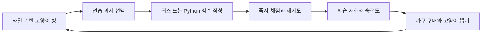

# 프로그래밍 학습 고양이 게임 구현 계획

## 1. 목표

프로그래밍 초보 학습자가 짧은 Python 연습 과제를 풀고, 얻은 학습 재화로 고양이를 수집하고 타일 기반의 방을 꾸미는 온라인 게임을 만든다.

핵심 반복 구조는 다음과 같다.



이 계획은 `CONTEXT.md`, `docs/PDR.md`, `docs/adr/*`의 학습·보상·안전 결정을 유지한다. 플랫폼 우선순위는 최신 제품 결정에 따라 **설치 가능한 PWA**를 우선한다. 게임 화면은 하나의 PixiJS Canvas로 유지하고, 데스크톱 위젯 결합은 게임 코어가 안정된 이후의 선택적 어댑터로 둔다.

- 웹과 설치형 PWA를 하나의 Canvas 코드베이스로 제공한다.
- MVP의 직접 코딩 언어는 Python이다.
- 문제는 검증된 문제 은행에서 제공하고 결정론적 테스트로 채점한다.
- 오답에 벌칙을 주지 않으며 재시도를 제한하지 않는다.
- 하우징은 학습 성능과 무관한 꾸미기 기능이다.
- 방은 통짜 배경 이미지가 아니라 타일과 독립 오브젝트로 구성한다.
- 고양이 대화는 정서적 동반자 기능이며 채점이나 학습 판정에 사용하지 않는다.

## 2. 제품을 한 번에 만들지 않는 이유

현재 PDR의 전체 범위에는 학습, 코드 실행, 개인화, 경제, 하우징, 고양이 대화, 소셜, 운영 도구가 모두 포함되어 있다. 이를 동시에 구현하면 화면은 많지만 실제 반복 구조가 검증되지 않은 상태가 오래 지속된다.

따라서 다음 세 개의 완료 지점을 별도로 둔다.

1. **메인화면 프로토타입**: 타일 방의 렌더링과 조작을 검증한다.
2. **플레이 가능한 세로 슬라이스**: 방에서 과제를 풀고 보상을 받아 가구를 놓는 한 바퀴를 완성한다.
3. **PDR MVP**: 문제 은행, 안전한 코드 실행, 고양이 수집·대화, 공개 하우스까지 확장한다.

## 3. 권장 기술 구조

### 클라이언트

- **TypeScript + PixiJS**: 방, HUD, 메뉴, 과제 화면, 모달, 텍스트, 애니메이션과 포인터 판정을 모두 하나의 Canvas에서 담당한다.
- **Vite**: 웹 개발·빌드 환경으로 사용한다.
- **PWA 앱 셸**: manifest와 service worker로 설치, 자동 업데이트, 정적 게임 셸의 오프라인 재실행을 제공한다.

화면에 보이는 요소는 HTML/DOM 오버레이를 사용하지 않는다. PixiJS 장면 관리자가 홈, 학습, 상점, 뽑기, 편집 화면을 전환하고, 공통 Canvas UI 컴포넌트가 버튼·패널·목록·말풍선·텍스트 입력 영역을 그린다. 게임 상태와 렌더 객체는 분리해 상태를 직렬화하고 테스트할 수 있게 한다.

### 후속 데스크톱 위젯 어댑터

다음 구조는 PWA MVP 이후 선택적으로 제공한다. 현재 게임 구현과 PWA 출시에 포함하지 않는다.

일반 게임 창 하나를 전체 화면으로 띄우지 않고 역할이 다른 두 Canvas 창을 사용한다.

```text
Tauri process
├─ widget window
│  ├─ 투명·무테·작업표시줄 제외
│  ├─ 일반 앱보다 아래의 데스크톱 레이어
│  └─ 방, 가구, 고양이, 작은 HUD Canvas
└─ activity window
   ├─ 필요할 때만 여는 일반 포커스 창
   └─ Study, 코드 입력, 상점, 뽑기, 설정 Canvas
```

`widget window`는 기본적으로 바탕화면 오른쪽 아래에 놓고 위치·크기·모니터를 저장한다. 학습자는 트레이 메뉴나 위젯 편집 모드에서 이동·크기 조절·잠금·숨김을 선택할 수 있다. `activity window`는 Study 같은 집중 작업을 시작할 때 일반 창 레이어에 열리며, 닫으면 위젯만 남는다.

위젯 창 전체가 투명 사각형으로 마우스를 막지 않도록 실제 방과 버튼 영역만 입력 영역으로 등록한다. 투명 픽셀의 클릭은 아래의 바탕화면으로 전달한다. 편집 모드에서는 전체 위젯 경계를 입력 가능하게 바꾼다.

### OS별 데스크톱 결합

#### Windows

- Tauri 창의 HWND를 Rust에서 얻는다.
- 무테, 투명, 작업표시줄 제외, Alt+Tab 제외 스타일을 적용한다.
- 유휴 상태에는 포커스를 빼앗지 않는 스타일을 사용하고, 명시적인 상호작용 때만 입력을 활성화한다.
- 일반 앱 창보다 아래에 유지하되 작업표시줄과 시스템 UI를 덮지 않는다.
- Explorer 재시작, DPI 변경, 모니터 연결·분리 후 창을 다시 부착하고 위치를 복구한다.
- 바탕화면 아이콘 뒤에 창을 강제로 삽입하는 비공개 WorkerW 방식은 MVP 기본 경로로 사용하지 않는다. 위젯은 아이콘과 겹치지 않는 위치에 두고, 필요하면 후속 실험 기능으로 격리한다.

#### Linux X11

- EWMH의 데스크톱 창 유형과 BELOW, SKIP_TASKBAR, SKIP_PAGER, 모든 작업공간 힌트를 적용한다.
- X11 입력 영역을 방의 불투명·상호작용 영역에 맞춰 갱신한다.
- 주요 X11 창 관리자에서 위치·레이어·가상 데스크톱 동작을 검증한다.

#### Linux Wayland

- 지원되는 컴포지터에서는 layer-shell의 `background` 또는 `bottom` 레이어와 입력 영역을 사용한다.
- layer-shell은 일반 Tauri xdg-toplevel 창에 나중에 붙일 수 없으므로, Wayland 전용 네이티브 surface host 또는 전용 플러그인이 필요하다.
- layer-shell을 제공하지 않는 컴포지터에서는 일반 무테 위젯 창으로 폴백하며, 이 경우 정확한 바탕화면 레이어와 모든 작업공간 동작을 보장하지 않는다.
- 설치 시 현재 세션이 X11인지 Wayland인지, layer-shell을 지원하는지 감지해 지원 모드를 표시한다.

### 위젯 동작 모드

```text
Idle       바탕화면에 표시, 낮은 FPS, 포커스 없음
Interact   고양이·버튼 클릭 가능
Edit       이동·크기 조절·가구 배치 가능
Hidden     전체 화면 앱 또는 학습자 설정에 따라 숨김
Suspended  화면 잠금·절전 중 렌더링과 네트워크 중지
```

유휴 상태에는 애니메이션을 10~15 FPS로 낮추고, 상호작용 중에만 60 FPS로 올린다. 다른 앱이 전체 화면이거나 화면이 잠기면 렌더링을 중지한다.

### 서버

- **TypeScript API 서버**: 계정, 학습 이력, 문제 은행, 재화, 인벤토리, 하우징, 고양이 뽑기와 소셜 규칙을 담당한다.
- **PostgreSQL**: 서버의 권위 있는 진행 상태를 저장한다.
- **별도 Python 샌드박스 워커**: 제출 코드를 일회성 격리 환경에서 실행한다.
- **콘텐츠 검증 작업**: AI가 생성한 문제 후보를 게임 요청 경로 밖에서 검증해 문제 은행에 등록한다.

PDR MVP에서는 학습 재화, 고양이 뽑기 결과, 과제 최초 완료 여부를 반드시 서버가 판정한다. 서버를 연결하기 전 프로토타입은 `LocalGameClient`가 같은 계약으로 상태 전이를 검증하며, 화면은 로컬·원격 구현을 구분하지 않는다.

### 서버 확장 후 저장소 구조

현재 단일 PWA의 실제 구조와 역할별 경계는 `docs/ARCHITECTURE.md`를 기준으로 한다. 서버와 샌드박스가 추가되어 단일 앱 유지가 어려워질 때만 다음 워크스페이스 구조로 확장한다.

```text
apps/
  web/                 PixiJS Canvas 앱, PWA 셸과 웹 진입점
  api/                 게임 API 서버
workers/
  sandbox-worker/      Python 제출 실행 워커
packages/
  domain/              공통 타입과 게임 규칙
  room-engine/         타일 좌표, 정렬, 충돌, 이동
  content-schema/      문제와 테스트 데이터 스키마
  canvas-ui/           버튼, 패널, 목록, 텍스트 등 Canvas UI
  platform-bridge/     후속 플랫폼 어댑터용 경계
public/assets/
  room/                바닥, 벽, 가구 스프라이트
  cats/                고양이 스프라이트 시트
  ui/                  아이콘과 프레임
```

프로토타입 단계에는 복잡한 모노레포 도구를 먼저 도입하지 않는다. 디렉터리 경계와 타입 경계를 만들고, 빌드가 실제로 복잡해질 때 워크스페이스 설정을 추가한다.

## 4. 메인화면과 방 시스템

### 4.1 화면 구성

PWA 메인화면은 하나의 Canvas 안에서 다음 렌더 레이어로 나눈다.

1. **배경 레이어**: 방 밖의 여백과 분위기 배경
2. **게임 장면 레이어**: 바닥, 벽, 가구, 고양이
3. **Canvas UI 레이어**: 프로필, 재화, Study, 퀘스트, 고양이 목록, 설정
4. **오버레이 레이어**: 모달, 말풍선, 알림과 화면 전환 효과

HUD도 PixiJS로 그리지만 방 장면의 카메라 컨테이너에는 넣지 않는다. 방은 화면 크기에 따라 확대·이동하고 HUD는 화면 좌표에 고정한다. 텍스트는 이미지에 굽지 않고 PixiJS `Text` 또는 `BitmapText`로 렌더링한다.

### 4.2 아이소메트릭 격자

초기 기준은 2:1 아이소메트릭 격자로 잡는다.

- 논리 격자: `10 × 8`
- 논리 렌더 타일: `112 × 56px`
- 기준 논리 화면: `1600 × 900`, 반응형 축소·확대
- 좌표 변환:

```text
screenX = originX + (gridX - gridY) * tileWidth / 2
screenY = originY + (gridX + gridY) * tileHeight / 2
```

논리 좌표는 해상도와 분리한다. 화면 크기가 바뀌면 카메라 컨테이너의 배율과 위치만 조정한다.

### 4.3 장면 데이터

```ts
type RoomSnapshot = {
  roomId: string;
  width: number;
  height: number;
  floorTileId: string;
  leftWallTileId: string;
  rightWallTileId: string;
  objects: RoomObject[];
  cats: RoomCatState[];
};

type RoomObject = {
  instanceId: string;
  assetId: string;
  x: number;
  y: number;
  rotation: 0 | 1;
};

type RoomCatState = {
  instanceId: string;
  catId: string;
  x: number;
  y: number;
  state: "idle" | "wander" | "use-furniture";
};
```

`RoomSnapshot`은 서버 확장 시 사용할 직렬화 가능한 목표 모델이다. PixiJS의 `CatActor` 같은 렌더 객체를 상태에 넣지 않는다. 현재 프로토타입의 저장 형식은 `GameState`를 기준으로 한다.

게임 시스템의 오브젝트 원형에는 다음 항목을 둔다.

- 격자 점유 형태
- 배치 가능한 영역
- 통과 가능 여부
- 고양이 상호작용 지점
- 상점 분류와 가격

리소스 카탈로그에는 스프라이트, 방향별 프레임과 렌더 기준점만 둔다. 가격과 충돌 규칙을 이미지 메타데이터에 섞지 않는다.

MVP의 직사각형 가구는 너비·높이와 두 회전 상태로 점유를 계산한다. L자형 가구나 통과 가능한 공간이 실제 요구될 때 셀 마스크로 확장한다.

### 4.4 표시 순서

기본 정렬 키는 `x + y`로 잡고 다음 우선순위를 함께 사용한다.

```text
바닥 < 바닥 장식 < 가구/고양이 < 벽 장식 < HUD 효과
```

같은 깊이에서 겹치는 오브젝트는 발이 닿는 기준점의 화면 Y, 오브젝트 종류, 안정적인 instance ID 순서로 정렬한다. 큰 가구가 여러 셀을 점유할 때는 가장 앞쪽 점유 셀을 기준점으로 사용한다.

### 4.5 배치 모드

배치 모드는 일반 플레이와 별도의 상태로 둔다.

- 인벤토리에서 가구 선택
- 유효한 셀은 강조, 충돌 셀은 붉게 표시
- 드래그 또는 탭으로 위치 선택
- 회전, 확정, 취소, 보유함으로 회수
- 여러 변경을 임시 초안에 반영
- 저장 시 서버가 소유권과 충돌을 다시 검증

삭제는 실제 아이템 삭제가 아니라 인벤토리 회수로 처리한다.

### 4.6 고양이 동작

첫 버전의 고양이는 다음 상태만 가진다.

```text
Idle → Wander → UseFurniture → Idle
  └──────────── Clicked/Talk ────────────┘
```

- 이동은 점유 격자를 사용하는 짧은 경로 탐색으로 처리한다.
- 접속하지 않았다고 상태가 나빠지지 않는다.
- 가구의 상호작용 지점에 도달하면 앉기·잠자기 등의 애니메이션을 재생한다.
- 고양이 클릭 시 Canvas UI 레이어에 말풍선 또는 대화 패널을 연다.
- 자유 대화 AI는 세로 슬라이스 이후에 연결하고, 초기에는 검증용 고정 대사를 사용한다.

## 5. 아트 자산 규격

방 전체 그림을 만들지 않고 다음 단위로 제작한다.

| 자산 | 초기 규격 | 비고 |
| --- | --- | --- |
| 바닥 | 112×56 기준 타일 | 반복 경계가 보여서는 안 됨 |
| 벽 | 좌·우 방향별 모듈 | 모서리와 벽지 교체 가능 |
| 작은 가구 | 1×1 또는 1×2 점유 | 투명 PNG/WebP |
| 큰 가구 | 2×2, 3×2 등 | 발 기준점 메타데이터 필수 |
| 고양이 | 방향별 스프라이트 시트 | idle, walk부터 시작 |
| UI 아이콘 | 독립 SVG 또는 PNG | 텍스트는 이미지에 포함하지 않음 |

모든 자산은 동일한 카메라 각도, 광원 방향, 외곽선 굵기, 바닥 접점 규칙을 따른다. 자산 파일과 별도로 메타데이터를 두어 코드에서 픽셀 값을 하드코딩하지 않는다.

## 6. 개발 단계

### 단계 0 — 기반 결정 고정

산출물:

- 기준 해상도, 타일 크기, 방 크기 확정
- 색상·외곽선·광원·캐릭터 비율을 담은 간단한 아트 가이드
- 클라이언트·서버·샌드박스 경계 확정
- PWA manifest, service worker, 설치 이벤트와 오프라인 앱 셸 기술 스파이크 완료
- 아래의 미결정 사항 중 세로 슬라이스에 필요한 항목 결정

완료 조건:

- 임시 타일과 상자만으로도 좌표·정렬 규칙을 설명할 수 있다.
- 방 데이터가 특정 이미지 배치에 종속되지 않는다.
- 배포 빌드가 service worker의 제어를 받고 네트워크 없이 정적 게임 셸을 다시 연다.

### 단계 1 — 메인화면 프로토타입

구현 범위:

- 전체 화면 Canvas와 반응형 HUD
- PWA manifest, 설치 버튼, 자동 업데이트 service worker
- 오프라인 앱 셸과 온라인 기능의 연결 상태 안내
- 직렬화 가능한 상태에서 생성되는 10×8 아이소메트릭 방
- 바닥과 두 방향 벽
- 서로 다른 크기의 임시 가구 5개
- 배치, 이동, 회전, 회수와 충돌 검사
- 고양이 1마리의 대기와 격자 이동
- 화면 크기에 따른 카메라 배율과 위치 조정
- 로컬 저장으로 방 상태 복원

완료 조건:

- 통짜 배경 이미지 없이 방이 구성된다.
- 데스크톱 포인터로 방과 편집 모드를 사용할 수 있다.
- 오브젝트가 겹칠 때 표시 순서가 안정적이다.
- 화면 비율이 달라져도 방과 HUD가 잘리지 않는다.
- 설치형 PWA와 일반 브라우저에서 동일한 게임 흐름을 제공한다.
- 네트워크를 끊어도 캐시된 메인화면을 다시 열 수 있다.

### 단계 2 — 플레이 가능한 세로 슬라이스

한 번의 전체 반복 구조만 완성한다.

1. 메인 방에서 `Study` 선택
2. 문제 은행의 고정 퀴즈 한 문제 제공
3. 정답·오답과 재시도 표시
4. 최초 완료 학습 재화 지급
5. 방으로 복귀해 가구 하나 구매
6. 구매한 가구 배치
7. 앱 재시작 후 진행 상태 복원

이 단계에서는 로그인, AI 생성, 실제 Python 실행, 고양이 뽑기, 소셜 기능을 최소화하거나 개발용 프로필로 대체할 수 있다. 단, API와 데이터 타입은 이후 서버 권위 구조로 바꿀 수 있게 설계한다.

완료 조건:

- 학습과 꾸미기가 실제로 한 바퀴 연결된다.
- 같은 문제를 반복해도 최초 완료 보상이 중복 지급되지 않는다.
- 실패·재접속 상황에서도 획득한 가구와 방 배치가 일관된다.

### 단계 3 — 학습 핵심 기능

- 네 가지 퀴즈 유형
- 함수 본문만 편집하는 Python 과제 화면
- 일회성 코드 샌드박스와 테스트 기반 채점
- 즉시 피드백, 단계적 힌트, 무제한 재시도
- MVP 학습 트랙의 문제 은행
- 개념별 숙련도와 기초·응용·도전 추천
- 학습자의 직접 과제 선택
- 콘텐츠 신고와 비활성화 절차

완료 조건은 PDR의 과제 제공, 채점, 학습 경험 기준을 자동화된 통합 테스트로 검증하는 것이다.

### 단계 4 — 수집과 하우징 확장

- 가구 상점과 인벤토리
- 벽지와 바닥 교체
- 고양이 단일 및 10+1회 뽑기
- 공개 확률, 보장 횟수, 중복 교환
- 고양이 여러 마리 배치
- 쓰다듬기, 놀기, 간식, 가구 반응
- 서버 저장과 여러 기기 간 동기화

경제 규칙은 서버에서 원자적으로 처리하고, 모든 재화 변동에 원인과 중복 방지 키를 기록한다.

### 단계 5 — 고양이 대화와 소셜

- 고양이별 고정 페르소나
- 안전 필터를 거친 서버 측 대화 호출
- 제한된 최근 문맥과 구조화된 기억
- 기억 열람과 삭제
- 공개 하우스 방문과 읽기 전용 돌봄
- 선택적 소규모 순위
- 이름·소개 필터, 신고, 임시 숨김, 운영 도구

공개 하우스는 편집 API를 노출하지 않는다. 방문 돌봄의 보상은 일일 중복 방지 규칙을 적용한다.

### 단계 6 — 출시 준비

- 유휴 화면의 CPU·GPU·메모리·배터리 사용량 측정
- 네트워크 끊김과 재시도 UX
- 키보드, 스크린리더, 색 대비 점검
- 코드 샌드박스 공격 테스트
- 경제·뽑기·보상 중복 공격 테스트
- PWA 설치·업데이트·오프라인·캐시 무효화 회귀 테스트
- 로그, 지표, 신고 처리 절차

## 7. 테스트 전략

### 단위 테스트

- 아이소메트릭 좌표의 왕복 변환
- 회전된 점유 셀 계산
- 충돌과 방 경계 검사
- 표시 순서 정렬
- 경로 탐색
- 최초 완료 보상과 중복 방지
- 숙련도 갱신과 추천 규칙

### 통합 테스트

- 문제 제출 → 채점 → 보상 원장 반영
- 가구 구매 → 인벤토리 → 방 배치 저장
- 고양이 뽑기 → 보장 횟수 → 중복 교환
- 공개 하우스 조회가 소유자 상태를 변경하지 않는지 확인

### 화면 테스트

- 100%, 125%, 150%, 200% DPI와 서로 다른 해상도의 다중 모니터
- Chromium 계열 설치형 PWA와 일반 브라우저 모드
- service worker 최초 설치, 업데이트, 오프라인 재실행
- 마우스, 터치, 키보드 조작
- 긴 한국어 문구와 큰 재화 숫자
- 느린 네트워크와 저장 실패
- 가구가 많은 방의 프레임 성능

## 8. 첫 세로 슬라이스에서 하지 않을 것

- 자유 형식 런타임 연습 과제 생성
- 자유 대화와 장기 기억
- 공개 하우스와 순위
- 고양이 수십 종과 대량의 가구
- 자유 회전, 자유 크기 조절, 물리 시뮬레이션
- 유료 재화와 거래
- 플랫폼별 별도 UI

이 항목들은 구조상 확장 가능하게만 두고 첫 반복 구조가 검증되기 전에는 구현하지 않는다.

## 9. 후속 단계 전에 확정할 결정

다음 항목은 해당 기능을 구현하기 전에 ADR로 확정한다.

1. 고양이 뽑기의 확률·보장·중복 교환 수치
2. 신규 학습자의 초기 추천 기준과 오프라인 이력 충돌 우선순위
3. 고양이 기억 보존 기간과 삭제 범위
4. 공개 하우스의 구체적인 접근 범위, 그룹·닉네임 노출 정책
5. 공개 콘텐츠 신고 처리 권한과 서비스 기준
