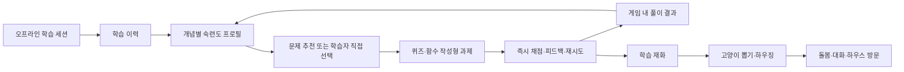
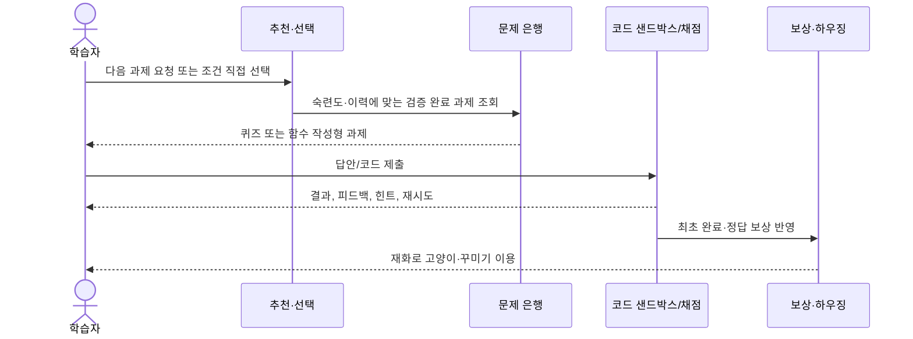

# 프로그래밍 학습 게임 — PDR

> **한 줄 요약**: 오프라인 학습 세션에서 배운 Python 기초를, 즉시 피드백·개인화 연습·수집형 보상으로 부담 없이 반복하게 하는 온라인 학습 게임

## 1. Product Overview

프로그래밍 초보 학습자를 위한 온라인 연습 보조 게임이다. 학습자는 퀴즈와 함수 작성형 Python 과제를 풀고, 즉시 피드백을 받으며 개념별 숙련도를 쌓는다. 학습 성과는 학습 재화로 보상되어 고양이 수집과 하우징 꾸미기로 이어진다.

첫 배포는 데스크톱 가로 화면을 우선한 설치형 PWA로 제공하며 일반 웹 브라우저에서도 같은 Canvas 프런트엔드를 사용한다. 반응형 브라우저 지원은 유지하지만 모바일 전용 UI와 Tauri 데스크톱 위젯은 PWA 게임 코어가 안정된 뒤의 후속 범위다. MVP의 직접 코딩 언어는 Python으로 한정한다.

## 2. Problem Statement

초보 학습자는 수업에서 배운 개념을 실제 코드에 적용할 반복 기회와, 실패해도 다시 시도할 수 있는 낮은 부담의 연습 환경이 필요하다. 반면 자유 형식 AI 생성·채점은 정답과 설명의 신뢰성을 보장하기 어렵고, 점수·경쟁만의 보상은 지속 동기를 약화시킬 수 있다.

## 3. Product Goal

- 오프라인 학습 세션을 대체하지 않고, 배운 내용을 독립적인 연습 과제로 반복하게 한다.
- 학습자의 개념별 상태에 맞는 과제를 제안하되, 학습자의 선택권을 보장한다.
- 채점과 콘텐츠 품질의 신뢰성을 확보하면서 수집·꾸미기·관계 형성으로 연습의 동기를 만든다.
- 처벌·과도한 경쟁·확률형 보상의 불투명성을 배제한 안전한 학습 경험을 제공한다.

## 4. 대상

| 대상 | 특성 및 필요 |
| --- | --- |
| 학습자 | 프로그래밍 경험이 거의 없으며, 수업 후 짧고 반복 가능한 연습과 부담 없는 피드백이 필요하다. |
| 교육 담당자 | 새 문제 유형·개념의 교육적 적합성을 검토하고 문제 은행 품질을 관리한다. |
| 운영자 | 공개 하우스·고양이 대화의 신고, 숨김, 반복 위반 제한을 관리한다. |

## 5. User Scenario

수업에서 반복문을 배운 민지는 게임에 접속한다. 홈에서 반복문 기초 과제를 추천받지만, 스스로 ‘함수 작성형·기초’를 골라 시작할 수도 있다. 고정된 함수의 본문을 작성해 제출하면 격리된 환경에서 테스트가 실행되고 결과와 짧은 설명을 즉시 본다. 틀리면 힌트와 함께 제한 없이 다시 풀고, 첫 완료와 테스트 통과에 따라 학습 재화를 얻는다. 재화로 가구를 배치하거나 고양이를 뽑고, 수집한 고양이와 대화하거나 다른 학습자의 공개 하우스를 구경한다.

## 6. Functional Requirements

1. 학습자는 퀴즈(선택형, 코드 실행 결과 예측, 오류 원인·올바른 코드 선택, O/X)와 함수 작성형 Python 과제를 풀 수 있다.
2. 시스템은 오프라인 학습 이력과 게임 내 수행 결과를 바탕으로 개념별 숙련도 프로필을 관리하고 다음 과제를 추천한다.
3. 학습자는 추천과 무관하게 과제 유형·개념·난이도(기초·응용·도전)를 선택할 수 있으며, 그 결과도 추천에 반영된다.
4. 코드 과제는 함수 이름·매개변수·기본 코드·테스트를 고정하고, 학습자는 함수 본문만 편집한다. 예시 입출력은 공개한다.
5. 제출 직후 자동 채점 결과, 짧은 설명, 단계적 힌트를 제공하며 오답은 무제한 재시도할 수 있다.
6. 학습 재화로 하우징 요소를 구매하고 단일 또는 10+1 고양이 뽑기를 이용할 수 있다.
7. 한 화면 숲 공터의 논리 격자에 가구·소품을 배치·이동·회전·삭제하고 장소 테마를 적용할 수 있다.
8. 고양이별 페르소나에 따른 대화와 세션 간 기억 열람·삭제를 제공한다. 고양이는 정서적 동반자이며 코딩 튜터가 아니다.
9. 공개 하우스는 읽기와 방문 돌봄만 허용한다. 선택적 소규모 그룹 순위와 신고·숨김·반복 위반 제한을 제공한다.

## 7. Business Rules

- 과제는 검증된 문제 은행에서만 제공한다. AI 생성물은 구조·문법·실행·테스트 검증을 통과해야 하며, 새 유형·개념은 교육 담당자 검토가 필요하다.
- Python 코드는 제출마다 독립된 샌드박스에서 결정론적 테스트로 채점한다. 모델의 설명은 채점 근거가 될 수 없다.
- 최초 완료에 기본 재화를, 정답 또는 테스트 통과에 추가 재화를 지급한다. 힌트 사용은 기본 보상을 유지하되 추가 보상에만 영향을 준다. 오답 벌칙은 없다.
- 같은 과제를 반복해 무한 보상을 얻을 수 없다. 방문 보상도 하루 첫 방문·돌봄 등으로 작고 제한적으로 제공하며, 학습 재화의 주 획득 수단은 문제 풀이이다.
- 재화의 현금 구매·거래·선물은 제공하지 않는다. 고양이 뽑기는 희귀도별 확률과 보장 기준을 공개하고, 중복은 교환 보상으로 전환한다. 기간 한정 뽑기는 없다.
- 하우징은 시각적 꾸미기 전용이며 학습 성과, 난이도, 고양이 획득 확률에 영향을 주지 않는다.
- 순위는 참여를 선택한 소규모 그룹에서만 제공한다. 최초 해결의 정확도·난이도·업적을 반영하며, 오답·힌트·속도·반복 풀이는 우위의 근거가 되지 않는다.

## 8. Acceptance Criteria

| 영역 | 완료 기준 |
| --- | --- |
| 과제 제공 | MVP 트랙의 개념 태그와 세 난이도를 가진 검증 완료 과제를 추천·직접 선택으로 제공한다. |
| 채점 | 모든 Python 제출은 네트워크·파일·프로세스가 차단된 일회성 환경에서 테스트로 판정하고, 제한 초과 이유를 안내한다. |
| 학습 경험 | 퀴즈·코드 과제는 즉시 결과와 피드백을 제공하며, 오답 재시도와 힌트 사용으로 기본 보상이 사라지지 않는다. |
| 보상 공정성 | 동일 과제와 반복 방문만으로 재화·순위 점수를 무한히 획득할 수 없다. 뽑기 확률·보장·중복 처리 규칙을 UI에서 확인할 수 있다. |
| 소셜 안전 | 방문자는 소유자 하우스·고양이·수집품을 변경하거나 가져갈 수 없고, 부적절한 공개 입력은 저장·공개되지 않으며 신고할 수 있다. |
| 플랫폼 | 일반 브라우저와 설치형 PWA에서 동일한 퀴즈·코드 작성·진행 핵심 흐름을 이용할 수 있고, 캐시된 정적 앱 셸을 네트워크 없이 다시 열 수 있다. |

## 9. Scope / Non-Scope

| MVP 범위 | MVP 제외 범위 |
| --- | --- |
| Python 기초 학습 트랙, 퀴즈, 함수 작성형 과제 | 다중 언어 지원, 표준 입출력 기반 전체 스크립트 과제, 자유 서술형 채점 |
| 설치형 PWA, 온라인 기반 개인화·검증된 문제 은행·서버 AI 호출 | 완전 오프라인 학습·동기화, 모바일 전용 UI, Tauri 위젯, 클라이언트 직접 AI 호출 |
| 고양이 수집·긍정적 돌봄·숲 공터 격자 꾸미기 | 유료 재화, 거래·선물, 기간 한정 뽑기, 하우징 능력치, 복잡한 물리 배치 |
| 공개 하우스·읽기 전용 방문·선택적 소규모 순위 | 전체 학습자 순위, 공동 편집, 방문자의 소유권 변경 |
| 값·변수·자료형부터 문자열·리스트·기초 디버깅까지 | 객체지향, 재귀, 복잡도 분석, 심화 자료구조·컴퓨터 구조 |

## 10. Data Requirements

| 데이터 | 필수 항목 | 이용 목적 |
| --- | --- | --- |
| 학습 이력 | 오프라인 세션 범위, 과제 시도·결과·시점 | 초기 맥락과 개인화 |
| 숙련도 프로필 | 개념별 숙련 상태 | 추천 난이도·주제 선택 |
| 문제 은행 | 유형, 개념 태그, 난이도, 템플릿, 테스트, 승인·활성 상태 | 신뢰 가능한 과제 제공·채점 |
| 보상·수집 | 재화 잔액, 보상 지급 이력, 고양이·장식 보유 및 뽑기 정책 | 경제 공정성·수집 경험 |
| 하우징 | 장소 테마, 격자 위치·방향·장식 ID | 개인 숲 공간 렌더링 및 공개 방문 |
| 고양이 기억 | 제한된 최근 문맥, 구조화된 사실·사건 요약 | 대화 연속성; 학습 판정에는 미사용 |
| 안전 운영 | 필터 결과, 신고, 임시 숨김, 제재 이력 | 공개 콘텐츠와 대화의 안전 관리 |

## 11. Non-Functional Requirements

- **보안**: Gemini API 키와 생성 정책은 서버에만 보관한다. 코드 샌드박스는 네트워크·파일 시스템·프로세스 생성을 차단하고 CPU·메모리·실행 시간·출력 크기를 제한한 뒤 폐기한다.
- **신뢰성**: 콘텐츠와 채점은 재현 가능해야 한다. AI 생성·서비스 장애·연결 끊김 시 상태와 복구 방법을 명확히 안내한다.
- **성능**: 검증된 문제 은행을 우선 사용해 과제 제공 지연과 실행 중 AI 생성 의존도를 낮춘다.
- **사용성**: 데스크톱 가로 화면을 우선하되 브라우저 크기에 반응하고, 설치형 PWA와 일반 브라우저에서 핵심 흐름을 일관되게 제공한다.
- **안전·개인정보**: 위험 요청은 페르소나와 무관하게 거절·안전 안내로 전환한다. 학습자는 고양이 기억을 열람·삭제할 수 있다.

## 12. Edge Cases

| 상황 | 기대 동작 |
| --- | --- |
| 신규 학습자에게 수행 데이터가 없음 | 오프라인 학습 이력과 기초 난이도부터 시작하며, 초기 추천 기준을 명시한다. |
| 오프라인 이력과 게임 수행 결과가 상충 | 양쪽 데이터를 보존하고, 우선 규칙이 확정되기 전에는 보수적인 추천과 재선택을 허용한다. |
| 무한 루프·과도한 출력·금지 접근 코드 제출 | 샌드박스가 중단·폐기하고 자원 제한 초과 사유를 이해하기 쉽게 표시한다. |
| AI 생성 콘텐츠 검증 실패 또는 오류 신고 누적 | 등록하지 않거나 즉시 비활성화하고 대체 과제를 제공한다. |
| 연결 또는 생성 서비스 장애 | 진행 중인 입력을 보존 가능한 범위에서 유지하고 재시도 안내를 제공한다. |
| 안전 정책 위반 대화·공개 입력 | 위험 대화는 거절 및 도움 안내, 공개 입력은 저장·공개 전 차단; 신고 콘텐츠는 임시 숨김할 수 있다. |
| 중복 고양이·반복 방문·반복 풀이 | 중복은 교환 보상으로 전환하고, 보상 한도와 최초 해결 규칙을 적용한다. |

## 13. Success Metrics

| 목표 | 측정 지표 |
| --- | --- |
| 반복 연습 정착 | 주간 활성 학습자당 완료 연습 과제 수, 재방문율 |
| 학습 효용 | 개념별 첫 시도 대비 재시도 후 정답률, 기초→응용 난이도 이동 비율 |
| 개인화 품질 | 추천 과제 선택률, 추천 후 완료율, 직접 선택 후 완료율 |
| 신뢰성 | 채점 오류 신고율, 검증 실패 콘텐츠의 노출률, 샌드박스 제한 초과율 |
| 건강한 동기 | 문제 풀이 대비 방문 보상 비중, 재화 획득의 문제 풀이 비율, 과도한 반복 풀이 비율 |
| 안전성 | 필터 차단·신고 처리 시간, 재발 제재율, 기억 삭제 요청 처리율 |

## 14. Open Questions

1. 오프라인 학습 이력과 게임 수행 데이터가 충돌할 때 어떤 데이터를 우선해 추천할 것인가?
2. 신규 학습자의 초기 숙련도와 추천 기준은 어떻게 정할 것인가?
3. 고양이 희귀도별 확률, 보장까지의 횟수, 중복 교환 가치의 구체적 수치는 무엇인가?
4. 방문 보상의 일일 한도·중복 방문 판정과 소규모 순위 반영 방식은 무엇인가?
5. 공개 하우스의 접근 범위, 그룹 가입·탈퇴, 닉네임 노출, 부정행위 대응은 어떻게 설계할 것인가?
6. 고양이 기억의 보존 기간, 삭제 방식, 운영자 접근 범위는 무엇인가?
7. 필터 오탐·누락, 신고 검토, 이의 제기, 운영자 권한의 서비스 기준은 무엇인가?
